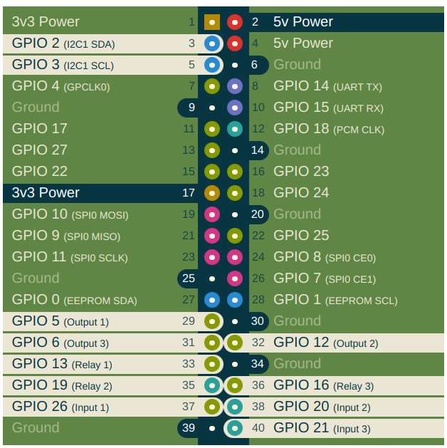
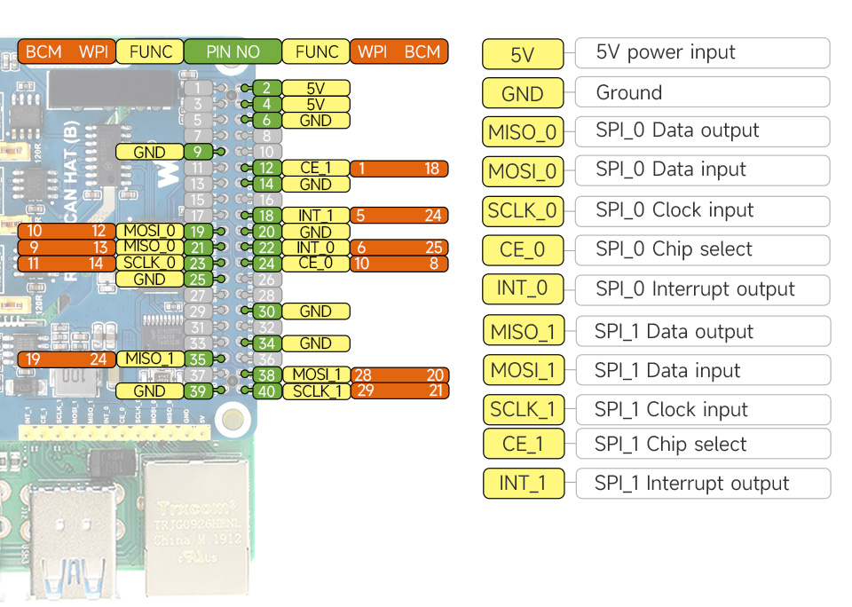
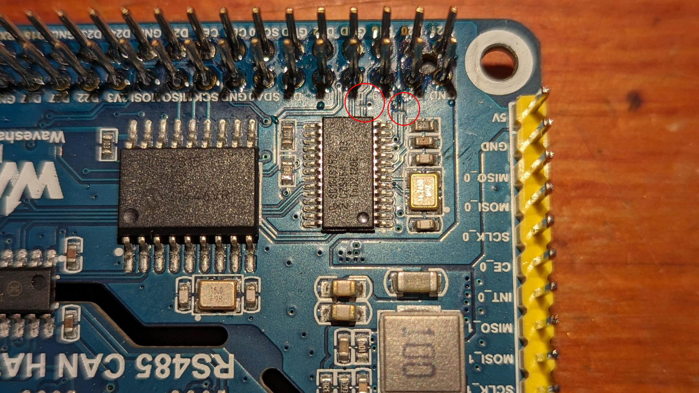
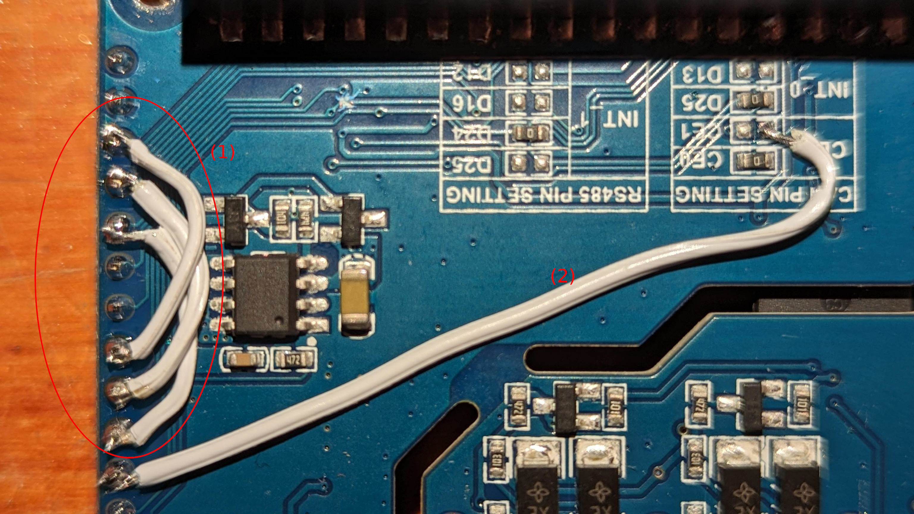

# rs485canhat-b-single-spi

RS485 CAN HAT (B) uart moved to spi0 cs1 (so now you can use Automationhat on a top of it).

## Words of warning

You need some degree of electronics experience, soldering skill and **precision**!
You can damage your equipment (if you are clumsy enough) so you do it at your own responsibility.


## Background

Since i have some spare RPI's i decided to use them for my small automation project.
Pimoroni Automnationhat and Waveshare RS485 CAN HAT (B) seem to be a perfect mix however there is fundamental problem:

**Automationhat is using GPIO directly causing a conflict with SPI1 which is used for Waveshare hat UART chip:**


Automationhat pinout: https://pinout.xyz/pinout/automation_hat




Waveshare RS485 CAN HAT (B) pinout: https://www.waveshare.com/wiki/RS485_CAN_HAT_(B)




## Idea for the fix

Waveshare board provides two rs485 and one can interfaces. Total baudrate required to operate all this interfaces at max simultaneously is approximately 3Mbit's however:

- most of rs485 (Modbus) devices are likely to run with baudrates slower than 38400
- i do not expect any rs485 link to be 100% utilized in a full time
- i do not expect any high load on Can bus
- i know that MHz does not equal Mbit but it is still good enough

So in total i do not expect any bandwidth related issues while running on SPI0 with two chip select signals. Latency should not be impacted as well since we consider relatively low interface baudrates in comparison to spi frequency.


Manufacturer setup is shown below:

```
dtparam=spi=on
dtoverlay=mcp2515-can0,oscillator=16000000,interrupt=25,,spimaxfrequency=1000000
dtoverlay=sc16is752-spi1,int_pin=24
# max spi freq of uart chip is 4000000 (according to dts file from rpi linux repo)
```

In baseline design CAN chip is running with 1MHz spi and uart is running with 4Mhz. Information about maximum spi clock frequency can be extracted from respective datasheets. Safe choice here is to choose the spi clock speed for a slowest device. **In this application sc16is752 is a limiting our operations to 5MHz.**


## Hardware mod

Goals:
- cut off spi1 signals of a uart chip from the rpi gpio header (SCLK_1, MISO_1, MOSI_1,  CE_1)
- preserve spi connections between yellow pinhead and uart chip (what a nice soldering point)


**Use force Luke is a very very bad idea here. Be patient and use sharp precision knife/scalpel instead!**


1. Cut off the uart spi signals from rpi gpio pinhead (SCLK_1, MISO_1, MOSI_1 CE_1).




2. Cut off uart's CE_1 from the rpi gpio pinhead. You must do that on the right side of a trace!


3. Validate the cuts using multimeter. __No connectivity__ between spi1 on yellow pinhead and respective pins on rpi gpio pins is our goal. Optionally secure the cuts with coating.
   

4. Connect UART SPI0.
   
(1) connect following spi0 and spi1 singals using yellow pinhead solder points: MISO, MOSI, SCK

(2) uart spi chipselect must be connected to SPI0_CS1 (aka. GPIO7 (pin26))




Done.


## Software mod

Let's compile custom dtoverlay on our RPI:

```
dtc -@ -Hepapr -I dts -O dtb -o /boot/overlays/sc16is752-spi0-cs1.dtbo sc16is752-spi0-cs1.dts
```

You can test this overlay online. Note that custom overlay for sc16is752 will load only once per boot (spidev can only be disabled once).

```
dtoverlay sc16is752-spi0-cs1 int_pin=24

```

You can also load CANbus chip overlay:

```
dtoverlay mcp2515-can0 oscillator=16000000 interrupt=25 spimaxfrequency=5000000
```

After that you should see both of them:

```
# dmesg | grep spi
[   12.698336] spi0.1: ttySC0 at I/O 0x0 (irq = 185, base_baud = 921600) is a SC16IS752
[   12.704698] spi0.1: ttySC1 at I/O 0x1 (irq = 185, base_baud = 921600) is a SC16IS752
[   13.031352] mcp251x spi0.0 can0: MCP2515 successfully initialized.

# ls -la /dev/ttySC*
crw-rw---- 1 root dialout 237, 0 Oct 28 10:20 /dev/ttySC0
crw-rw---- 1 root dialout 237, 1 Oct 28 10:18 /dev/ttySC1

# ip a s can0
3: can0: <NOARP,ECHO> mtu 16 qdisc noop state DOWN group default qlen 10
    link/can
```

Now you can connect your devices and perform the tests. Useful commands below:

```
apt -y install can-utils picocom

# rs485 loopback test can be done this way:
picocom -b 38400 /dev/ttySC0 
picocom -b 38400 /dev/ttySC1

# except internal loopback test CANbus test requires another CAN device:
# configure the interface on both sides (two rpi's with can involved)
ip link set can0 up type can bitrate 1000000
ifconfig can0 txqueuelen 65536

# dump some data on one end
candump can0

# generate some data on the another
cangen can0 -I i -L 8 -g 10

```

## Permanent configuration

Just replace standard Waveshare configuration in `/boot/config.txt` with new one:

```
dtparam=spi=on
dtoverlay=mcp2515-can0,oscillator=16000000,interrupt=25,,spimaxfrequency=5000000
dtoverlay=sc16is752-spi0-cs1,int_pin=24

```

